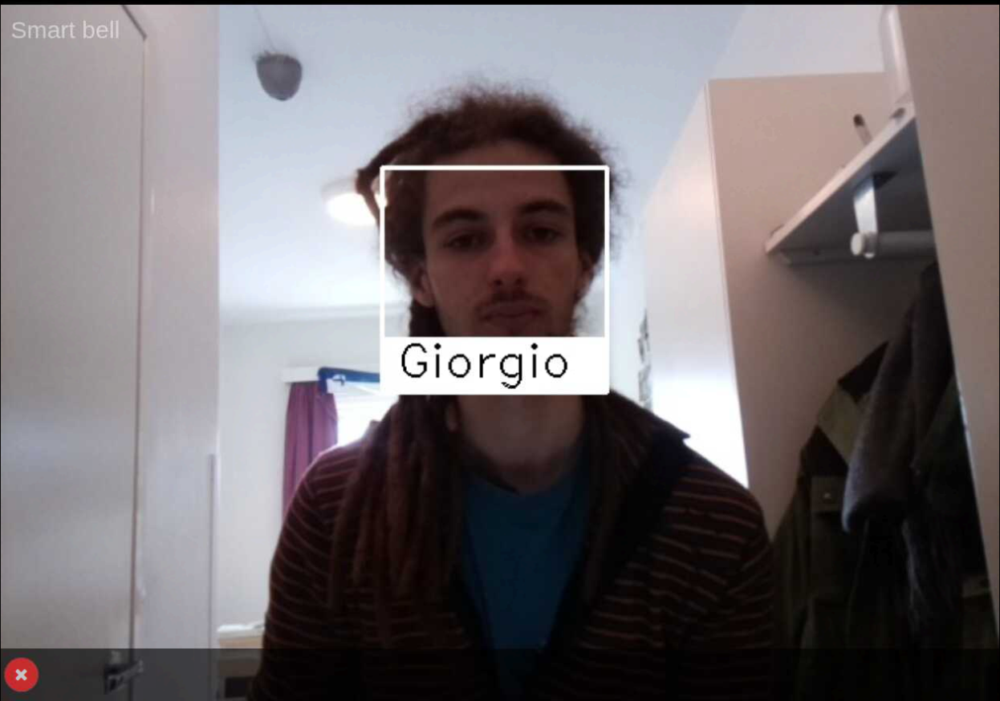
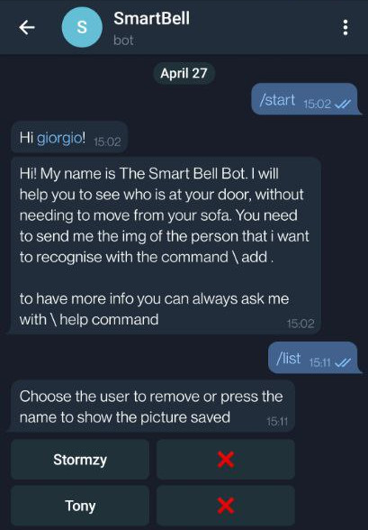
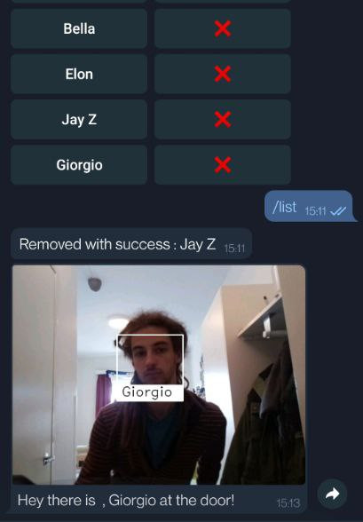
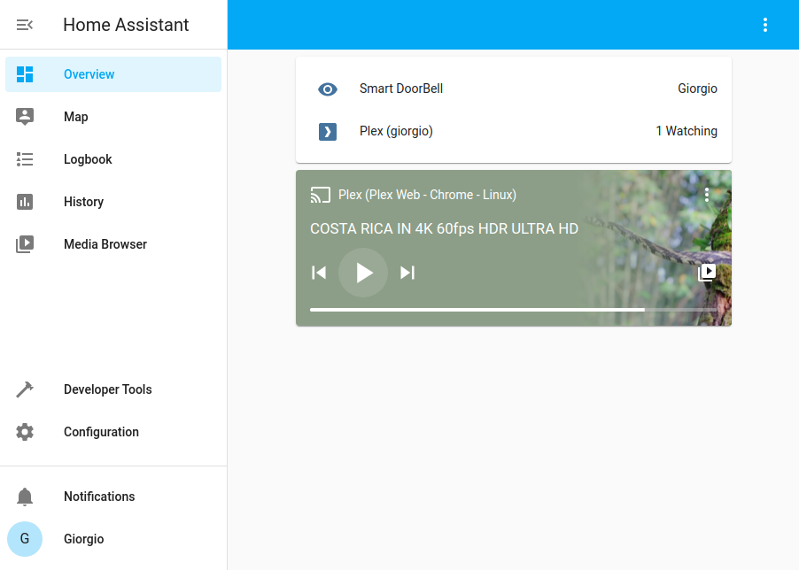

# Smart Bell
We have realized a Smart Bell, that is able to recognize the person in front of the camera.
The bell is manageable via a telegram bot that allows the user to insert and remove a person from the known person that the bell has to recognize.
If one of the known persons is in front of the camera, the user is going to receive a telegram message with the picture capture from the bell.
An MQTT message will trigger an automation in home assistant, and in case a film is played, the movie is going to be paused to allow the user to open the door without losing a second of the film!
The user can always check the video of the camera by connecting to a web page.
We have also created a docker container, with the application and all the services/libraries needed to run the application, in this way is easy to set up the application without the need to install any library by hand.

## Face recognition
During the first part of the project, we have followed a tutorial on how to build a [CCTV](https://smartbuilds.io/smart-cctv-camera-flask-video-streaming-opencv-raspberry-pi/) and, we have simplified and cleaned the code with just the part that streams the video on a web page and the usage of the face-recognition library with OpenCV.
We have decided to follow this tutorial because we want to realize a web page to stream the video of the camera, and using Flask was the simplest option that we have found.
This tutorial was great to start, but we have faced some problems, the program was not working properly with more than one person in front of the camera.
We have read the documentation of the face-recognition library, and we have found out that there was an error in the code in the tutorial, so we fixed it.
We have refactored the code to have a cleaner and more understandable source file.
We have built a class, and we have changed the data structure used.

## Development Process

### Telegram bot
When the web app was correctly working, We have realized a telegram bot, to notify the user when a known person is in front of the door, but also to manage the list of the known person(name and image).
In the beginning, we have thought to use  the [telepot library](https://telepot.readthedocs.io/en/latest/), because we had already used it in a previous course, but since the library is no longer maintained by the developer we have chosen to switch to [python-telegram-bot](https://python-telegram-bot.readthedocs.io/en/stable/).
Working with this new library was more difficult, but the documentation is great.
For this part of the project, we have followed the official documentation and studied from [these examples](https://github.com/python-telegram-bot/python-telegram-bot/tree/master/examples).

|  |   |
|---|---|

### MQTT and Home Assistant

Need to create a directory plex_media in ~/plex_media

The next step of this project was pausing the reproduction of a movie when someone is in front of the bell.
We have understood that the easiest way to do it was by using Home Assistant and program an automation.
We have checked if it was possible to achieve this goal without additional hardware ( e.g.\ AppleTV), and we have found out that was possible by setting up a plex media server.
We have set up a container with a Plex media server and connected it with an integration in Home Assistant.
We have added a new class in our project that is using the [paho-mqtt library](https://pypi.org/project/paho-mqtt/)to send an MQTT message to the broker server on the topic doorbell.
Home assistant is subscribed to this topic and when a message is received if a film is played is paused.

### Dockerize the application
During this step, we faced several problems, and we spend a lot of time before having the project working inside the container.
We have followed [this tutorial](https://docs.docker.com/language/python/build-images/) and we have tried to use the Dockerfile that we found on face\_recognition official documentation, we have added all the library needed to run OpenCV.
The installation can take a very long time (hours).
One of the problems that we faced was that from the container we were not able to access the camera, but thanks to [this tutorial](https://medium.com/swlh/how-to-access-the-raspberry-pi-camera-inside-docker-and-opencv-5fa25e092d91) we managed to solve the problem.
### Possible update
* Save the clip of video in a database, of when a person is recognized in front of the camera.
* When an unknown person is in front of the camera, could be possible to add the person
to the known person list from the telegram bot
*  With the message to notify the user, we can also add a link to check the live-streaming
of the camera
* Scaling the solution to allow multiple user with different smart bell to use the telegram
bot
  
## To start

When you lunch the app the first page to visit is [/init](localhost:5000/init), when the message with init done appear, you can visit the index page. 